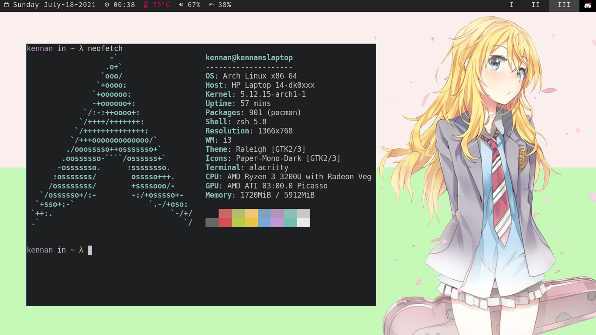
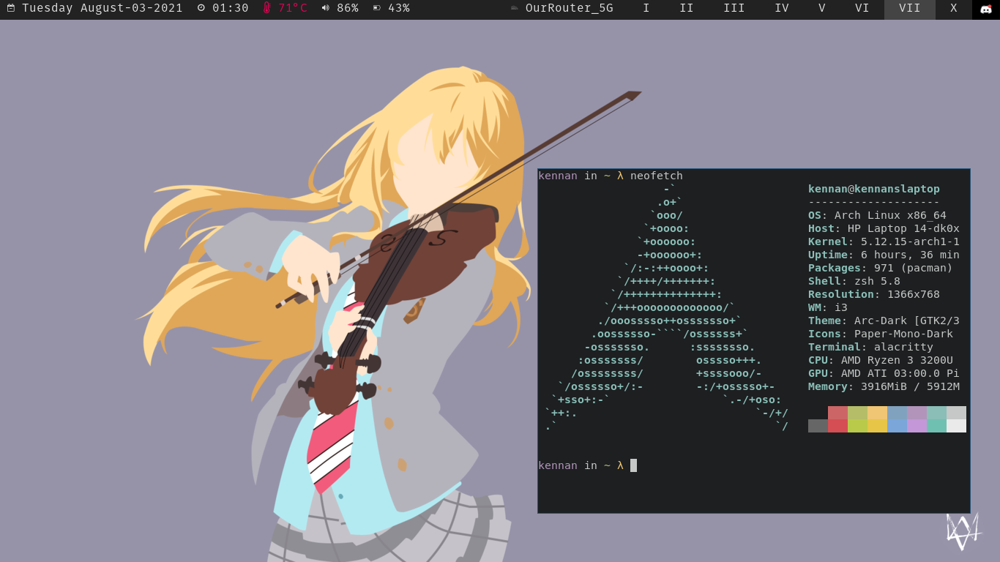

# Hi

Pronouns: He/Him

I have way too many projects I switch between to list here but my currently most pursued is a [fun little password manager](https://github.com/KennanHunter/bad-password-manager).

## What I use

### OS

For operating system i use Arch Linux with i3 and Polybar. I also use Oh-My-Zsh instead of bash, and the Alacritty terminal emulator. My Dotfiles are available probably somewhere, i still haven't set up the repo yet lmao.

### IDE

Currently I use VSCode, with the [FiraCode Font](github.com/tonsky/FiraCode), Monokai Color theme, and Material Icons. I also ocassionally pull out Vim in the command line. I hope to get better with Vim and potentially even switch over to it fully.

### Database

I personally like Postgresql, but i do wish to broaden my horizons on databases.

### Languages

My most used Languages are

- Rust
- TypeScript
- Python

As for JS/TS i personally use Svelte allot, which i believe is much better than React or Vue. I'm interested in seeing how the Yew project works out, which exclusively uses Rust/WASM.

I'm also a big fan of Docker and other Containerization technolodgies.

## Contact Me

The best way to contact me is my discord Kennan#4955.

## Other Links

- [MyAnimeList](https://myanimelist.net/animelist/Kennnan?status=7&order=4&order2=0)
- [(Empty) StackOverflow](https://stackoverflow.com/users/13185735/kennan-hunter)
- [Osu](https://osu.ppy.sh/users/17596931)

## some screenshots

 

